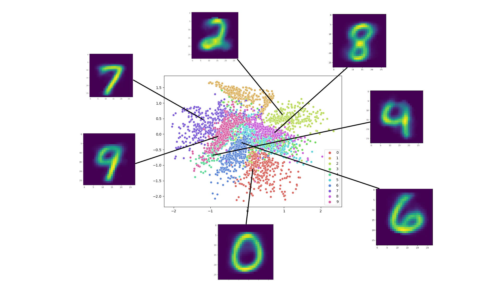
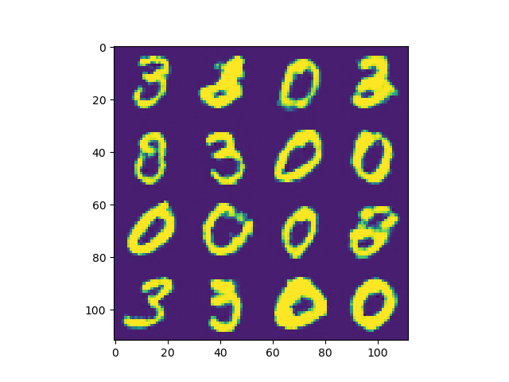
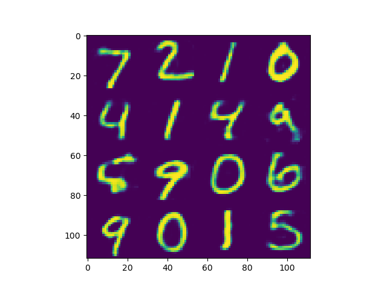
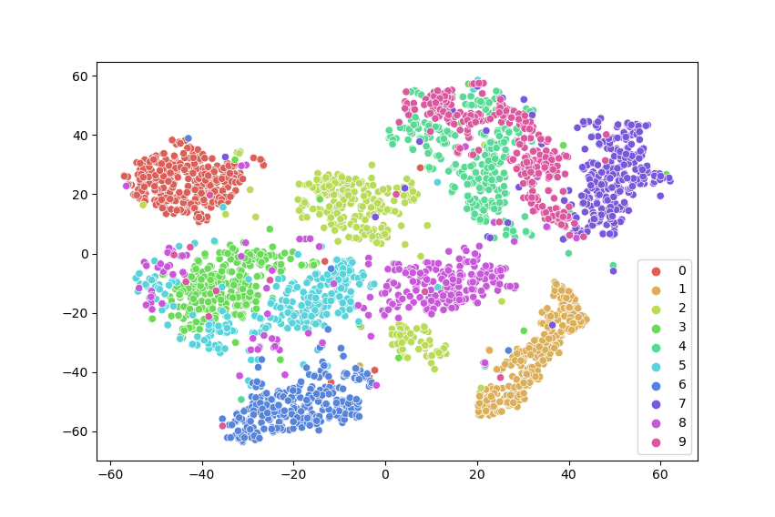

# PyTorch-Examples

## Variational Auto-Encoder

MNIST digits encoded in the 2-dimensional latent space with generative capabilities.

## Generative Adversarial Network

## Auto-Encoder

Reconstructed digits with an autoencoder.

Visualization of the latent space with t-sne.

